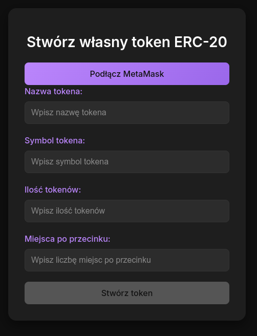

# Token Maker

## A ReactJS component that allows creating and deploying custom ERC-20 tokens.

- `CreateToken.tsx` – component for creating a token  
- `CreateToken.css` – CSS styling for the component  
- `SimpleERC20.sol` – smart contract for creating a token  

## Installation

Create a project using Vite: `npm create vite@latest`  
Compile the smart contract with the Solidity compiler. Download the `SimpleERC20.json` file and include it in your project.  

## Testing

For testing purposes, you can run the `anvil` tool from the `Foundry` package on your local machine. Add several private keys generated by `anvil` to MetaMask. Start the project using `npm run dev`, open the web application, connect your wallet, and enter the details of the token you want to deploy.  

After deployment, you can use your wallet to transfer tokens between accounts—once the corresponding token has been initialized in the wallet using the address of the deployed smart contract.  

## User Interface

